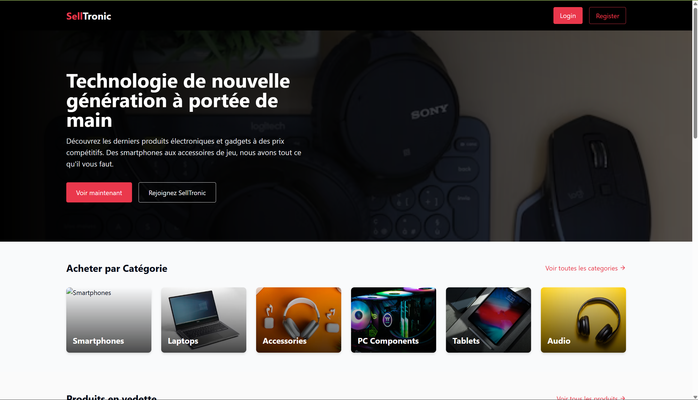
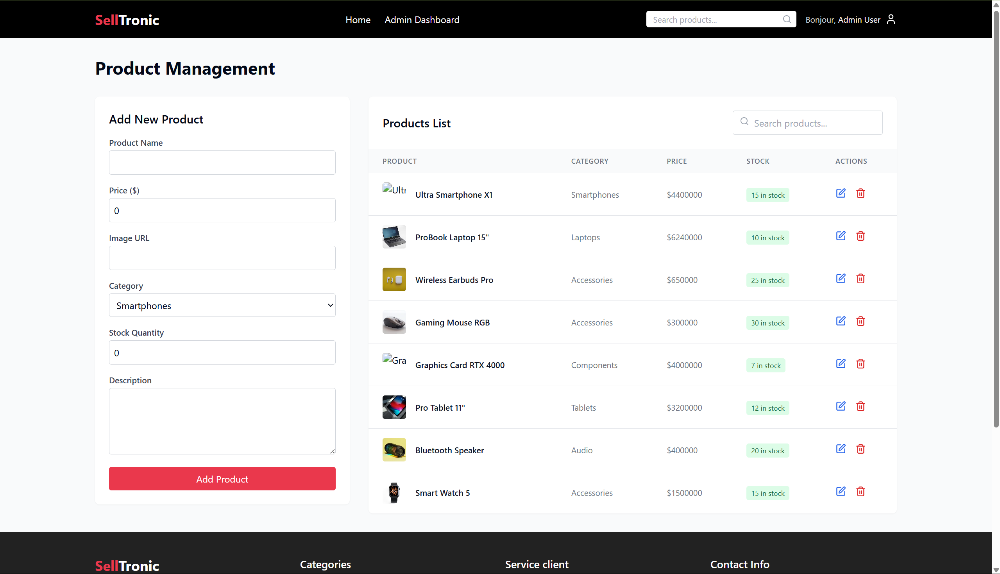
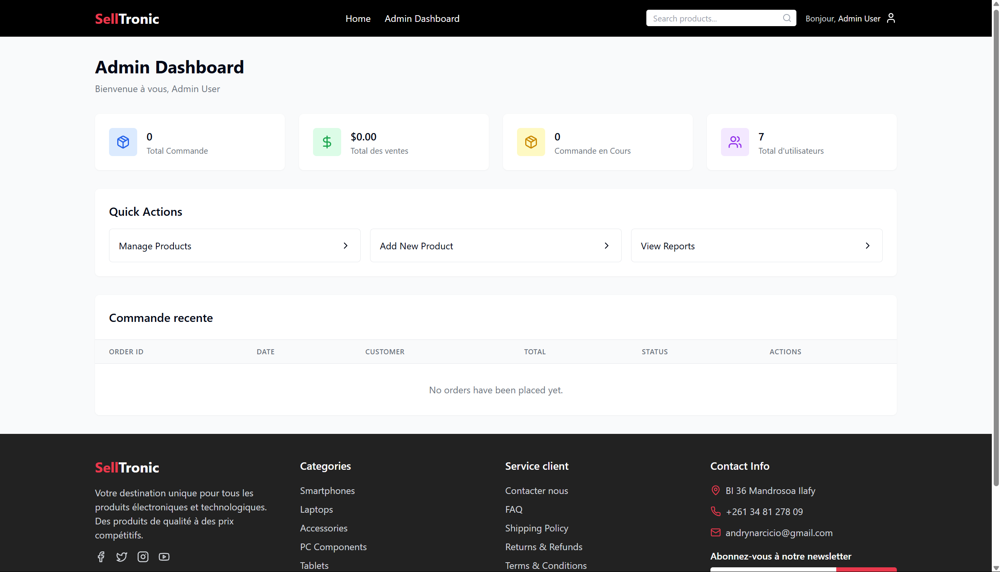
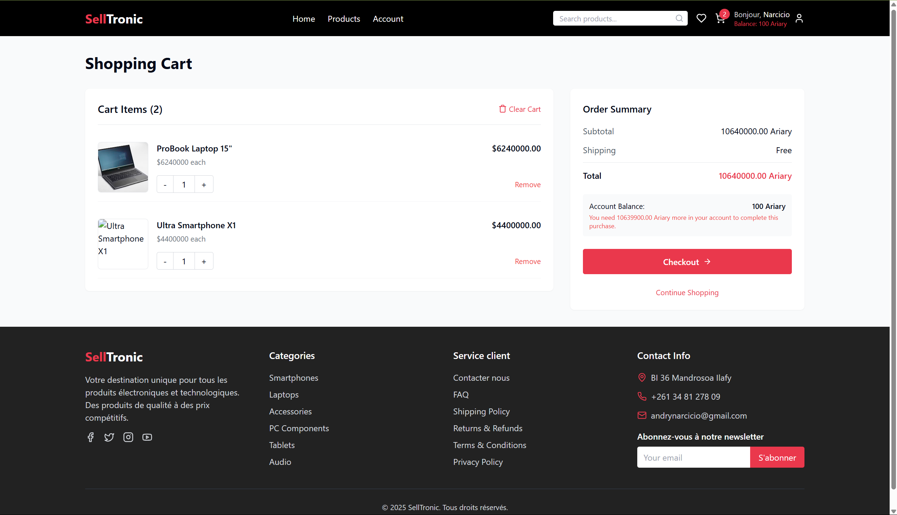
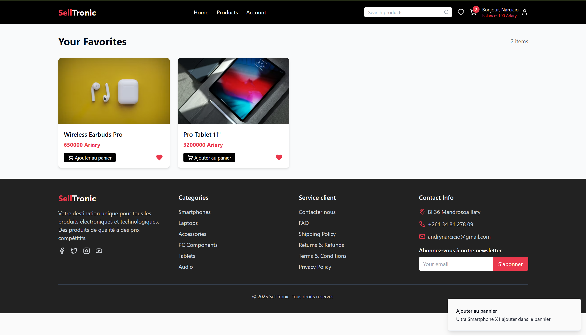
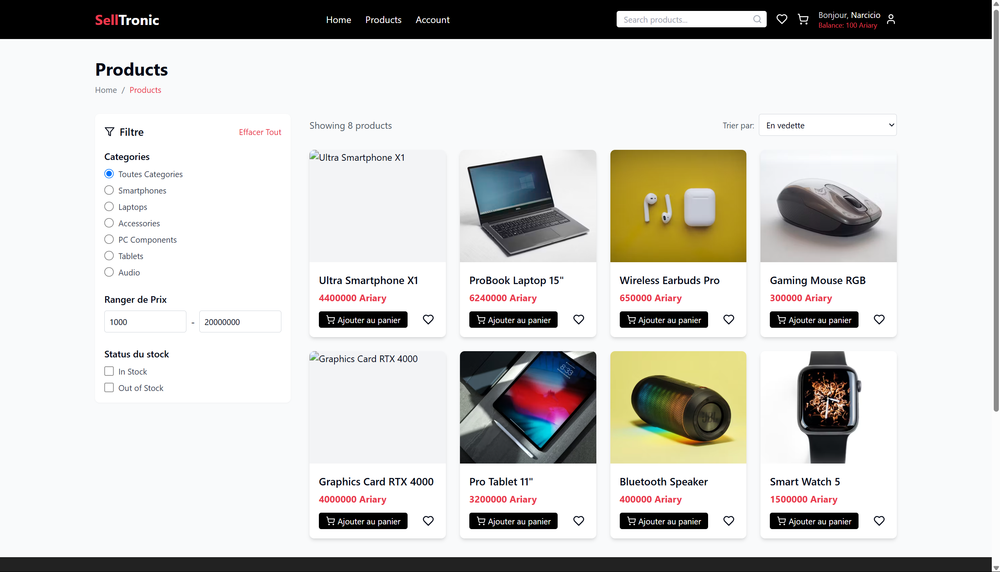
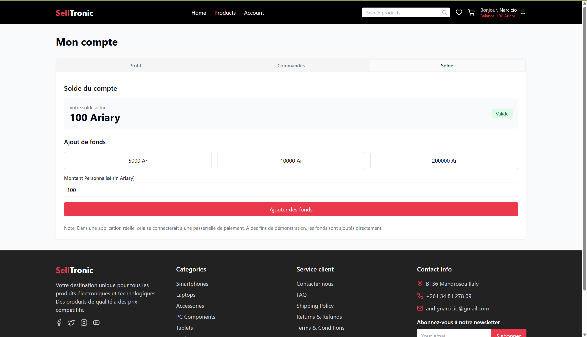

# SellTronic
- Bienvenue dans SellTronic. C'est une application web pour vente d'appareil éléctronique disponible à tous moment et sécurisé.
- Il est facile à utiliser et simple à comprendre.
- Le plateform est divisé en deux parties, dont la partie administrateur pour la gestion des produits et des ventes; et celui des acheteurs pour l'achat et le rechargement du compte.
- Cette application est programmé avec le framework Python Flask pour le côté backend et React + VITE pour la partie frontend.
- SellTronic vous présente des divers gamme de produit électronique comme des smartphones, tablettes, ordinateur, etc... avec des prix imbattables

# ETAPE A SUIVRE POUR LE LANCEMENT DU SELLTRONIC

# ETAPE 1  (Clonnage du projet):
* Veuillez clonez le projet sur votre ordinateur :
- git clone https://github.com/AndrianTiana200745/SellTronic.git
* Veuillez vous placer au niveau du projet dans votre invite commande
- cd SellTronic

## NB : Il est possible que vous ne puissez pas le cloner alors veuillez télécharger le projet uniquement

# ETAPE 2 (installation des dépendances du côté backend) :
- veuillez vous placer vers : "SellTronic/backend/.venv/Script/"
- ensuite écrivez "activate" : "SellTronic/backend/.venv/Script/activate"
* Cette etape permet d'activé l'environnement virtuel du projet.
## NB : Si vous n'avez pas encore d'environnement virtuel dans le projet, taper ceci : python -m venv .venv
## Cette étape vous permettra de créer un environnement et l'activer ensuite via "SellTronic/backend/.venv/Script/activate"
- veuillez installer les dépendances dans le dossier "requirement.txt"
* pip install -r requirement.txt
## Cela vous permettra d'installer tous les dépendances nécessaires.

# ETAPE 3 (installation des dépendances du côté frontend) :
- Veuillez vous mettre au niveau du racine du projet "/SellTronic/"
- Lancer ceci pour installer les dépendances pour le react : "npm install"

# ETAPE 4 (Lancement des serveurs) :
## Pour lancer le serveur Backend(Flask) :
* Mettez vous au niveau de la racine du projet "/SellTronic/"
* Lancez ce commande : "python -m backend.main"
* Cela lancera le serveur flask et ouvrera un port 5000 pour le côté backend.
## Pour lancer le serveur Frontend(React + vite) :
* Mettez vous au niveau de la racine du projet "/SellTronic/"
* Lancez ce commande : "npm run dev"
* Veuillez vous rendre à l'adresse IP présenter.

## VOICI QUELQUES PHOTOS DU PROJET SI VOUS AVEZ DU MAL A LE LANCER

